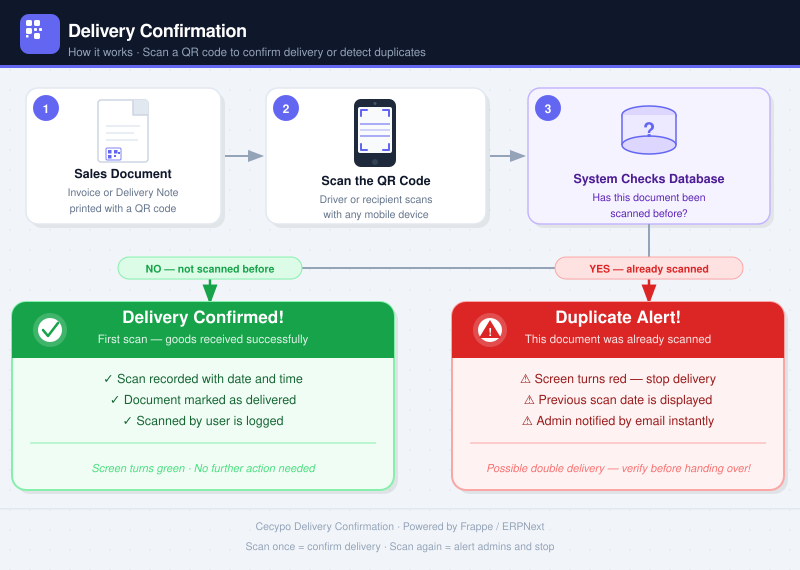

### Delivery Confirmation



Confirm delivery status by scanning a QR code on any mobile device. No login required for the scanner.

---

### `/delivery` Web Interface


---

### How It Works

1. A QR code on a physical document (e.g. a KRA eTIMS invoice) is scanned using the built-in camera scanner at `/delivery`.
2. The app extracts a value from the raw QR string based on the configured extraction method.
3. It looks up the matching document in ERPNext (e.g. the Sales Invoice where `etr_invoice_number = 999555`).
4. **First scan** → green screen, recipient fills in their details and confirms delivery. Optionally sends an email notification to the client contact on the document.
5. **Subsequent scans** → red alert showing who confirmed it, when, and how many times the document has been scanned. Optionally sends an email notification to configured admins.

---

### Configuration

Go to **Delivery Confirmation Settings** (Settings menu or `/desk/delivery-confirmation-settings`).

#### Document Matching

| Setting | Description |
|---|---|
| **Source DocType** | The DocType to search in, e.g. `Sales Invoice` |
| **Match Field** | The field whose value is extracted from the QR, e.g. `etr_invoice_number` |
| **QR Value Extraction Method** | How to pull the value out of the raw QR string (see below) |

#### Extraction Methods

**URL Parameter** — for QR codes that are URLs with query parameters.

Example QR string:
```
https://itax.kra.go.ke/KRA-Portal/invoiceChk.htm?actionCode=loadPage&invoiceNo=999555
```
Set `URL Parameter Name` = `invoiceNo` → extracts `999555`.

---

**Regex** — for any QR string where a regex can capture the value.

Example QR string: `INV-999555-KE`
Set `Regex Pattern` = `INV-(\w+)-` → extracts `999555`.
The first capture group `(...)` is used as the value.

---

**Full String** — the entire raw QR string is used as the field value directly.
Use this when the QR encodes exactly the field value with no extra text.

---

#### Duplicate Scan Notifications

Enable **Send Notification on Duplicate Scan** and add email addresses to the **Notification Recipients** table. An email is sent automatically whenever an already-confirmed document is scanned again. The notification includes the scan count, original confirmer, and delivery details.

---

#### Client Notification (on First Scan)

Enable **Send Notification to Client on Delivery** to automatically email the client when a delivery is confirmed for the first time.

| Setting | Description |
|---|---|
| **Client Email Field** | Field name on the Source DocType that holds the client's email address, e.g. `contact_email` |
| **Email Subject** | Subject line for the notification. Use `{doc_name}` as a placeholder, e.g. `Your delivery {doc_name} has been confirmed` |
| **Email Message** | Rich-text body of the email. Supported placeholders: `{doc_type}`, `{doc_name}`, `{delivered_to_name}`, `{scanned_at}` |

If no custom message is provided, a default confirmation email is sent.

---

### Installation

```bash
bench get-app https://github.com/Cecypo-Tech/frappe_delivery_confirmation --branch version-16
bench install-app cecypo_delivery_confirmation
bench --site <your-site> migrate
```

### License

mit
